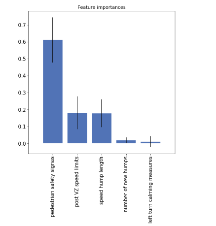

# NycVisionZero
 Vision Zero NYC Open Data Analysis

## Visualisation 1

### Figure interpretation
The first choropleths on the left above show the hotspots and coldspots, ie, the police precints having high incidence(hotspots) and low incidence(coldspots). High collision cluster can be found in the precincts of Queens. There is a cluster of precincts in Manhattan which is a center of low collisions.

However, the corresponding bar chart shows that the borough which has the highest proportions of collision from 2014-2018 is Brooklyn, followed by Manhattan and Queens. Thus, the collisions in Brooklyn are then more dispersed across the borough than Queens.

With bikesharing companies like Citibike rolling out its services, the number of cyclists collisions have increased. The hotspots in red indicate high collision clusters in Manhattan and Brooklyn which is not surprising. Also, Staten Island borough can be safely regarded as a cold-spot. It accounts for a neglible percentage of collisions involving cyclists.

The above graphs , while they tell us what we already know. Thus, we need to look into the street conditions and its characteristics to better understand what might be causing the acccidents.

## Visualisation 2

### Figure interpretation
The above figure shows how important the features are when it comes to predicting the number of collisions on the given street conditions. The random forest regression tree has an r-squared value about 0.35, which means it can explain about 35% of the variance. This graph is therefore a confirmation that existing street conditions are a reliable indicator of the collision conditions.

Future work involves unearthing more other street conditions and developing a classifier to identify what type of accidents a particular street is more prone to

